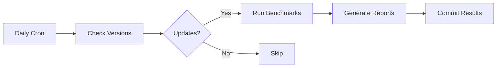

<div align="center">

# 🏆 JavaScript Library Benchmarks

### *Professional performance benchmarks for popular JavaScript libraries*

[](https://github.com/sylphxltd/benchmark/actions)
[](https://nodejs.org)
[](https://vitest.dev)
[](LICENSE)

[View Benchmarks](#-benchmark-categories) • [Methodology](#-methodology) • [Contributing](#-contributing)

</div>

---

## 🎯 What is This?

Automated, unbiased performance benchmarks comparing popular JavaScript libraries across different categories. All benchmarks run automatically when libraries update, ensuring you always have the latest data.

<table>
<tr>
<td width="33%" valign="top">

### ⚡ Always Fresh
Benchmarks auto-run when libraries release new versions. No stale data.

</td>
<td width="33%" valign="top">

### 📊 Comprehensive
Multiple real-world test scenarios per category. Not just toy examples.

</td>
<td width="33%" valign="top">

### 🎯 Actionable
Clear insights help you make informed library choices for your projects.

</td>
</tr>
</table>

---

## 📊 Benchmark Categories

<table width="100%">
<tr>
<td width="50%" valign="top">

### 🗃️ [State Management](./benchmarks/state-management/)

Compare performance of React state management libraries

**Libraries Tested:**
- Zustand • Jotai • MobX
- Redux Toolkit • Valtio
- Preact Signals • Solid Signals
- Recoil • **[@sylphx/zen](https://github.com/sylphxltd/zen)**

**Test Scenarios:**
- ✓ Simple & Computed Updates
- ✓ Nested Object Operations
- ✓ Array Manipulations
- ✓ Async Operations
- ✓ Batch Updates
- ✓ Deep Nesting (5 levels)
- ✓ Large State (1000 items)

<div align="center">

**Status:**  •
**Libraries:** 9 •
**Tests:** 13

[View Results →](./benchmarks/state-management/)

</div>

</td>
<td width="50%" valign="top">

### 🔄 [Immutability](./benchmarks/immutability/)

Compare performance of immutability helper libraries

**Libraries Tested:**
- Immer • Mutative
- Immutable.js • Immutability Helper
- Seamless Immutable
- **[@sylphx/craft](https://github.com/sylphxltd/craft)** *(coming soon)*

**Test Scenarios:**
- ✓ Simple & Nested Updates
- ✓ Array Push/Remove/Update
- ✓ Deep Nested Update (5 levels)
- ✓ Large Array Update (1000 items)
- ✓ Multiple Updates (3 changes)
- ✓ Native JS Comparison

<div align="center">

**Status:**  •
**Libraries:** 5 •
**Tests:** 8

[View Results →](./benchmarks/immutability/)

</div>

</td>
</tr>
<tr>
<td width="50%" valign="top">

### 🧭 [Router](./benchmarks/router/)

Compare performance of React routing libraries

**Libraries Tested:**
- React Router • TanStack Router
- Wouter
- **[@sylphx/zen-router](https://github.com/sylphxltd/zen-router)** *(coming soon)*

**Test Scenarios:**
- 🚧 Route Matching
- 🚧 Navigation Performance
- 🚧 Parameter Parsing
- 🚧 Nested Routes
- 🚧 Large Route Trees

<div align="center">

**Status:**  •
**Libraries:** 3 •
**Tests:** Coming Soon

[View Structure →](./benchmarks/router/)

</div>

</td>
<td width="50%" valign="top">

### 🎨 More Categories Coming

Have suggestions for new benchmark categories?

**Potential Categories:**
- 📝 Form Libraries (React Hook Form, Formik, Zod)
- 🎨 UI Component Libraries (MUI, Ant Design, Chakra)
- 📡 Data Fetching (TanStack Query, SWR, Apollo)
- 🔍 Validation Libraries
- 📅 Date Manipulation
- 🧮 Math/Number Formatting

<div align="center">

[Suggest a Category →](https://github.com/sylphxltd/benchmark/issues)

</div>

</td>
</tr>
</table>

---

## 🔬 Methodology

### Test Environment
```
Framework:      Vitest Bench (statistical benchmark engine)
Node Version:   20+
Hardware:       GitHub Actions (ubuntu-latest)
Iterations:     3 complete runs averaged
Warm-up:        Yes (JIT optimization)
```

### Metrics Collected
- **Operations/sec** - Higher is better
- **Variance (RME)** - Lower is better (more consistent)
- **Mean Time** - Average execution time
- **p99** - 99th percentile performance
- **Bundle Size** - Minified + Gzipped via Bundlephobia API

### Smart Automation


Benchmarks only run when:
- ✅ A library releases a new version
- ✅ Test files are modified
- ✅ Manual workflow trigger

---

## 🚀 Quick Start

### View Results Online
Just browse to any category folder:
- [State Management Results](./benchmarks/state-management/)
- [Immutability Results](./benchmarks/immutability/)
- [Router Results](./benchmarks/router/)

### Run Locally

```bash
# Clone the repo
git clone https://github.com/sylphxltd/benchmark.git
cd benchmark

# Install root dependencies
npm install

# Run a specific category
cd benchmarks/state-management
npm install
npm run benchmark

# Generate report
npx tsx ../../scripts/generate-readme.ts .
```

### Run All Categories

```bash
# From project root
for category in benchmarks/*/; do
  cd "$category"
  npm install
  npm run benchmark
  npx tsx ../../scripts/generate-readme.ts .
  cd ../..
done
```

---

## 🏗️ Project Structure

```
benchmark/
├── 📊 benchmarks/
│   ├── state-management/     # State libs (9 libraries)
│   ├── immutability/         # Immutability helpers (5 libraries)
│   └── router/               # Routing libs (3 libraries, WIP)
│
├── 🛠️ scripts/
│   ├── check-versions.ts     # Version checker + Bundlephobia API
│   └── generate-readme.ts    # README generator with insights
│
├── ⚙️ .github/workflows/
│   └── benchmarks.yml        # Unified workflow (parallel checks)
│
└── 📄 README.md              # You are here
```

Each benchmark category is self-contained:
```
benchmarks/category-name/
├── package.json              # Dependencies for this category
├── library-metadata.json     # GitHub URLs & display names
├── versions.json             # Version tracking & size data
├── src/
│   └── benchmark.bench.ts    # Vitest benchmark tests
├── results/
│   └── latest.json           # Latest benchmark results
└── README.md                 # Generated report with insights
```

---

## 🤝 Contributing

### Adding a New Library

1. **Update `package.json`** - Add the library
2. **Update `library-metadata.json`** - Add GitHub link
3. **Add benchmark tests** - In `src/benchmark.bench.ts`
4. **Run benchmarks** - `npm run benchmark`
5. **Generate README** - `npx tsx ../../scripts/generate-readme.ts .`
6. **Submit PR** - Include before/after results

### Adding a New Category

1. **Create directory** - `benchmarks/your-category/`
2. **Copy structure** - From an existing category
3. **Add libraries** - Update package.json and metadata
4. **Write tests** - Create benchmark scenarios
5. **Update main README** - Add to categories table
6. **Test locally** - Run full benchmark suite
7. **Submit PR** - With sample results

### Guidelines

- ✅ Real-world test scenarios (not toy examples)
- ✅ Fair comparisons (same task, same data)
- ✅ Clear test descriptions
- ✅ Multiple test categories per benchmark
- ✅ Include native JS baseline when relevant

---

## 📈 Benchmark Results Format

Each category README includes:

<table>
<tr>
<td width="25%">

**📋 Information**
- Last updated date
- Environment details
- Test framework
- Iteration count

</td>
<td width="25%">

**📦 Versions**
- Current versions
- Last updated dates
- Bundle sizes (gzip)

</td>
<td width="25%">

**📊 Bundle Size**
- Ranked by size
- Minified + Gzipped
- Relative comparisons

</td>
<td width="25%">

**🏆 Results**
- Top performers
- Detailed metrics
- Key insights
- Performance ratios

</td>
</tr>
</table>

---

## 🎯 Why Trust These Benchmarks?

### ✅ Transparent
- Open source code
- Reproducible locally
- Clear methodology
- Version tracked

### ✅ Automated
- Daily checks for updates
- No manual bias
- Consistent environment
- Statistical significance

### ✅ Comprehensive
- Real-world scenarios
- Multiple test categories
- Bundle size included
- Native baselines

### ✅ Up-to-date
- Auto-runs on library updates
- Latest versions always
- Size data from Bundlephobia
- Commit history visible

---

## 📊 Interesting Findings

<details>
<summary><b>State Management: Signals vs Stores</b></summary>

Signal-based libraries (Preact Signals, Solid Signals, @sylphx/zen) consistently outperform traditional stores for simple updates, with 20-30M ops/sec vs 200-800K ops/sec.

However, for complex scenarios with heavy computation, the gap narrows significantly.

</details>

<details>
<summary><b>Immutability: Native vs Libraries</b></summary>

Native JavaScript spread operators are fastest for simple updates, but libraries like Mutative and Immer excel at deep nested updates where native code becomes verbose and error-prone.

Bundle size matters: Immer adds ~11KB gzipped vs native 0KB.

</details>

<details>
<summary><b>Bundle Sizes: The Hidden Cost</b></summary>

Smallest to largest (state management):
- Zustand: 1.17KB → Recoil: 23.48KB (20x difference!)

For most apps, any state library <5KB is negligible. Choose based on API preference and features, not just size.

</details>

---

## 🙏 Credits

<div align="center">

**Developed and maintained by [Sylph](https://github.com/sylphxltd)**

Special thanks to all library authors for building amazing tools.

### Supporting Tools
[Vitest](https://vitest.dev) • [Bundlephobia](https://bundlephobia.com) • [GitHub Actions](https://github.com/features/actions)

---

### Star this repo if you find it useful! ⭐

[⬆ Back to Top](#-javascript-library-benchmarks)

</div>
