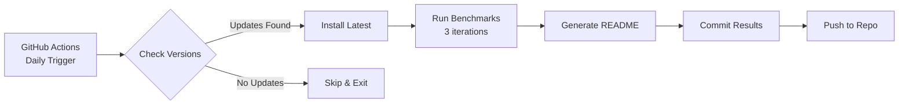

# Benchmark Hub 🏆

**Automated, professional performance benchmarks for JavaScript/TypeScript libraries.**

<p align="center">
  <strong>🤖 Fully Automated</strong> •
  <strong>📊 Always Up-to-Date</strong> •
  <strong>🔄 Daily Checks</strong> •
  <strong>📈 Historical Tracking</strong>
</p>

---

## 🎯 What is This?

A **zero-maintenance benchmark system** that automatically:
- ✅ Checks for library updates **daily**
- ✅ Runs benchmarks **only when needed** (new versions or test changes)
- ✅ Generates professional reports with **version tracking**
- ✅ Commits results automatically via **GitHub Actions**

**No manual work required.** Set it and forget it. 🚀

---

## 📂 Available Benchmarks

| Category | Description | Libraries | Status | Last Updated |
|----------|-------------|-----------|--------|--------------|
| **[State Management](./benchmarks/state-management/)** | Redux, Zustand, Jotai, MobX, Valtio, Preact Signals, Solid Signals, Zen | 8 libraries | ✅ Active | Auto-updated |
| **Immutability Libraries** | Immer, Craft.js, Native JS | Coming Soon | 🚧 Planned | - |
| **HTTP Clients** | Axios, Fetch API, Got, Undici | Coming Soon | 📋 Planned | - |
| **Date Libraries** | Day.js, date-fns, Luxon, Moment | Coming Soon | 📋 Planned | - |

---

## 🚀 How It Works

### Automated Daily Workflow



### Smart Update Detection

The system **only runs benchmarks** when:
1. **📦 Library has new version** - Detects npm updates automatically
2. **📝 Test files modified** - Tracks file hashes to detect changes
3. **🔧 Manual trigger** - Can be triggered manually via GitHub Actions

If nothing changed → **Benchmark is skipped** → Zero waste of CI resources ⚡

---

## 📊 Example: State Management Benchmarks

Latest results from our **State Management Benchmark**:

| Library | Version | Simple Increment | Loading Toggle | Status |
|---------|---------|------------------|----------------|--------|
| **Solid Signals** | `v1.9.10` | 35.7M ops/sec | 28.5M ops/sec | ✅ |
| **Preact Signals** | `v2.3.2` | 34.6M ops/sec | 27.0M ops/sec | ✅ |
| **Zen** | `v1.0.0` | 34.2M ops/sec | **32.5M ops/sec** 🥇 | ✅ |
| **MobX** | `v6.15.0` | 5.5M ops/sec | 6.8M ops/sec | ✅ |
| **Valtio** | `v1.13.2` | 4.8M ops/sec | 7.2M ops/sec | ✅ |
| **Jotai** | `v2.15.1` | 1.7M ops/sec | 2.0M ops/sec | ✅ |
| **Redux Toolkit** | `v2.10.1` | 887K ops/sec | 1.0M ops/sec | ✅ |
| **Zustand** | `v4.5.7` | 369K ops/sec | 382K ops/sec | ✅ |

👉 **[View Full State Management Benchmark](./benchmarks/state-management/)**

---

## 🔧 Adding New Benchmarks

Want to add a new benchmark category? Easy!

### 1. Create Category Structure

```bash
mkdir -p benchmarks/your-category
cd benchmarks/your-category

# Copy template files
cp -r ../state-management/package.json .
cp -r ../state-management/tsconfig.json .
cp -r ../state-management/vitest.config.ts .

# Create source directory
mkdir -p src
```

### 2. Write Your Benchmarks

```typescript
// src/benchmark.bench.ts
import { bench, describe } from 'vitest';

describe('Your Test Category', () => {
  bench('Library A', () => {
    // Your test code
  });

  bench('Library B', () => {
    // Your test code
  });
});
```

### 3. Create GitHub Actions Workflow

```yaml
# .github/workflows/your-category.yml
name: Your Category Benchmark

on:
  schedule:
    - cron: '0 0 * * *'  # Daily at midnight
  workflow_dispatch:

jobs:
  # ... copy from state-management.yml
```

### 4. Initialize Version Tracking

```bash
# Create versions.json
cat > versions.json << 'EOF'
{
  "lastChecked": "",
  "lastBenchmarkRun": "",
  "testFilesHash": "",
  "libraries": {
    "your-library": {
      "current": "1.0.0",
      "latest": "1.0.0",
      "lastUpdated": ""
    }
  }
}
EOF
```

### 5. Done! 🎉

The benchmark will now:
- ✅ Run daily automatically
- ✅ Check for updates
- ✅ Generate README reports
- ✅ Commit results

---

## 📈 Why This Approach?

### Traditional Benchmarks (Manual)
- ❌ Quickly become outdated
- ❌ Require manual updates
- ❌ No version tracking
- ❌ One-time snapshots

### Our Automated System
- ✅ **Always up-to-date** - Checks daily
- ✅ **Zero maintenance** - Fully automated
- ✅ **Version tracking** - Every result includes versions
- ✅ **Historical data** - All results saved
- ✅ **Resource efficient** - Only runs when needed
- ✅ **Professional reports** - Auto-generated README

---

## 🤝 Contributing

We welcome contributions! Here's how you can help:

1. **Add New Benchmarks** - Propose new library categories
2. **Improve Tests** - Suggest better test scenarios
3. **Fix Issues** - Report bugs or problems
4. **Documentation** - Help improve guides

### Development Setup

```bash
# Clone repository
git clone https://github.com/sylphxltd/benchmark-state-management.git
cd benchmark-state-management

# Install dependencies
npm install

# Run version check
npm run check-versions

# Generate README
npm run generate-readme
```

---

## 📊 Benchmark Methodology

All benchmarks follow these principles:

1. **Statistical Significance** - Multiple iterations until confidence achieved
2. **Real-world Scenarios** - Tests mirror actual usage patterns
3. **Fair Comparison** - Identical conditions for all libraries
4. **Version Tracking** - Every result tagged with library versions
5. **Automated** - No manual intervention or bias

---

## 📄 License

MIT License - see [LICENSE](./LICENSE) file for details.

---

## 🙏 Acknowledgments

- **Vitest** - Professional benchmarking framework
- **GitHub Actions** - Free CI/CD automation
- **All library authors** - For building amazing tools
- **Open source community** - For making this possible

---

<p align="center">
  <strong>⭐ Star this repo if you find it useful!</strong><br/>
  <sub>Made with ❤️ by the Sylph team</sub>
</p>

---

*Last updated: Auto-generated by GitHub Actions • [View Workflow](./.github/workflows/state-management.yml)*
