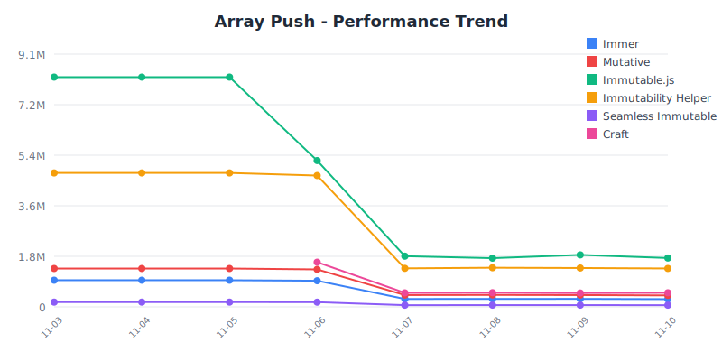
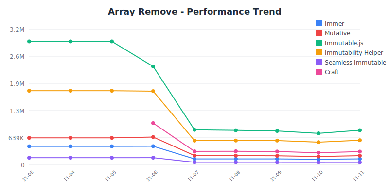
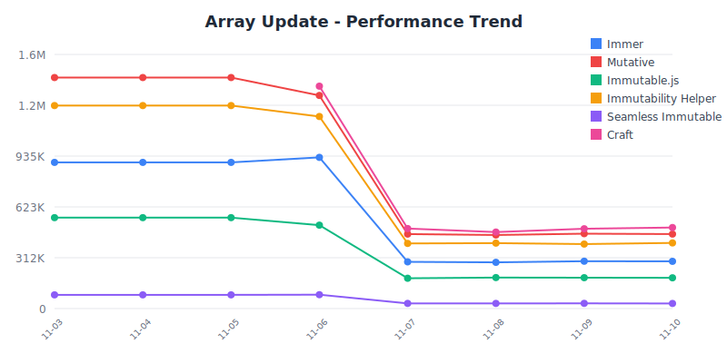
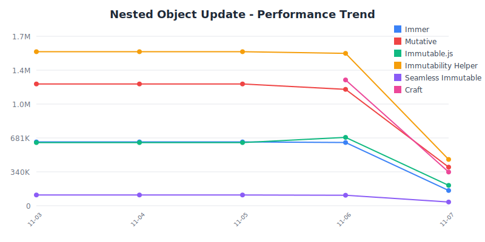
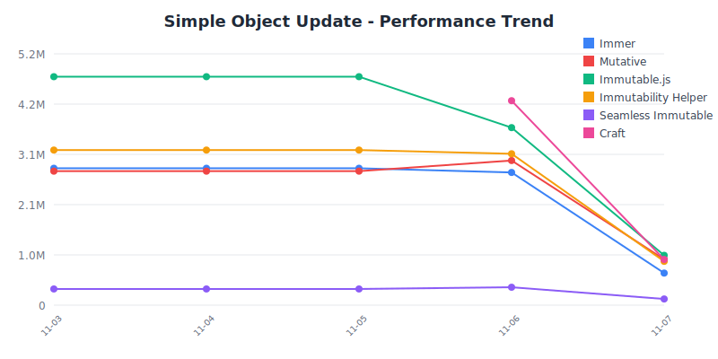

# State Management Benchmark 🏆

Professional performance comparison of JavaScript state management libraries.

## 📋 Benchmark Information

- **Last Updated:** January 1, 2025
- **Last Run:** 12:00:00 AM UTC
- **Environment:** Node.js v25.0.0, darwin arm64
- **Test Framework:** Vitest Bench
- **Iterations:** 3 runs averaged for statistical accuracy

## 📦 Library Versions

| Library | Version | Size (gzip) | Last Updated |
|---------|---------|-------------|-------------|
| **[@sylphx/craft](https://github.com/sylphxltd/craft)** | `v1.2.1` | 2.76KB | Nov 6, 2025 |
| **[immer](https://github.com/immerjs/immer)** | `v10.1.1` | 4.70KB | Nov 6, 2025 |
| **[immutability-helper](https://github.com/kolodny/immutability-helper)** | `v3.1.1` | 1.65KB | Nov 6, 2025 |
| **[immutable](https://github.com/immutable-js/immutable-js)** | `v4.3.7` | 17.74KB | Nov 6, 2025 |
| **[mutative](https://github.com/unadlib/mutative)** | `v1.1.1` | N/A | Nov 6, 2025 |
| **[seamless-immutable](https://github.com/rtfeldman/seamless-immutable)** | `v7.1.4` | 2.71KB | Nov 6, 2025 |

## 📦 Bundle Size Comparison

Smaller bundle sizes mean faster initial load times and better user experience.

| Rank | Library | Minified + Gzipped | Minified | Relative to Smallest |
|------|---------|-------------------|----------|---------------------|
| 🥇 | **[immutability-helper](https://github.com/kolodny/immutability-helper)** | 1.65KB | 4.68KB | Baseline |
| 🥈 | **[seamless-immutable](https://github.com/rtfeldman/seamless-immutable)** | 2.71KB | 7.55KB | 1.64x |
| 🥉 | **[@sylphx/craft](https://github.com/sylphxltd/craft)** | 2.76KB | 9.56KB | 1.67x |
| 📍 | **[immer](https://github.com/immerjs/immer)** | 4.70KB | 13.83KB | 2.84x |
| 📍 | **[immutable](https://github.com/immutable-js/immutable-js)** | 17.74KB | 65.04KB | 10.73x |

**Size Insight:** immutability-helper is the most lightweight at 1.65KB (gzip), while immutable is 10.73x larger at 17.74KB (gzip).

## 🏆 Top Performers

Quick overview of category winners:

| Category | 🥇 Winner | Ops/sec | Runner-up |
|----------|-----------|---------|----------|
| **Simple Object Update** | Native Spread | 44.03M | [Immutable.js](https://github.com/immutable-js/immutable-js) (4.66M) |
| **Nested Object Update** | Native Spread | 35.67M | [Immutability Helper](https://github.com/kolodny/immutability-helper) (1.49M) |
| **Array Push** | Native Spread | 36.02M | [Immutable.js](https://github.com/immutable-js/immutable-js) (7.00M) |
| **Array Remove** | Native Filter | 39.54M | [Immutable.js](https://github.com/immutable-js/immutable-js) (2.88M) |
| **Array Update** | Native Map | 30.84M | [Mutative](https://github.com/unadlib/mutative) (1.36M) |
| **Deep Nested Update (5 levels)** | Native Spread | 24.95M | [Immutability Helper](https://github.com/kolodny/immutability-helper) (890.86K) |
| **Large Array Update (1000 items)** | [Mutative](https://github.com/unadlib/mutative) | 1.08M | Native Map (565.83K) |
| **Multiple Updates (3 changes)** | Native Spread | 30.38M | [Immutability Helper](https://github.com/kolodny/immutability-helper) (782.69K) |

## 📜 Historical Results

Track performance changes over time:

| Date | Results | Notes |
|------|---------|-------|
| 2025-11-06 | [View Results](./results/2025-11-06.json) | Benchmark run |
| 2025-11-05 | [View Results](./results/2025-11-05.json) | Benchmark run |
| 2025-11-04 | [View Results](./results/2025-11-04.json) | Benchmark run |
| 2025-11-03 | [View Results](./results/2025-11-03.json) | Benchmark run |

> 💡 **Tip:** Compare historical results to track performance improvements or regressions over time.

### 📈 Performance Trends

Visual representation of performance over time:

**Array Push**



**Array Remove**



**Array Update**



<details>
<summary>View 2 more trend charts</summary>

**Nested Object Update**



**Simple Object Update**



</details>

## 📊 Detailed Results

### Simple Object Update

**Performance Comparison:**

```
🥇 Native Spread        ████████████████████████████████████████ 44.03M
🥈 Immutable.js         ████ 4.66M
🥉 Sylph Craft          ████ 4.41M
📍 Mutative             ███ 2.87M
📍 Immutability Helper  ███ 2.80M
📍 Immer                ███ 2.77M
📍 Seamless Immutable    378.32K
```

| Rank | Library | Ops/sec | Variance | Mean | p99 | Samples |
|------|---------|---------|----------|------|-----|--------|
| 🥇 | **Native Spread** | 44.03M | ±1.02% | 0.0227ms | 0.0420ms | 22.02M |
| 🥈 | **[Immutable.js](https://github.com/immutable-js/immutable-js)** | 4.66M | ±1.80% | 0.2145ms | 0.2920ms | 2.33M |
| 🥉 | **[Sylph Craft](https://github.com/sylphxltd/craft)** | 4.41M | ±0.27% | 0.2270ms | 0.2920ms | 2.20M |
| 📍 | **[Mutative](https://github.com/unadlib/mutative)** | 2.87M | ±0.68% | 0.3489ms | 0.5420ms | 1.43M |
| 📍 | **[Immutability Helper](https://github.com/kolodny/immutability-helper)** | 2.80M | ±9.67% | 0.3568ms | 0.7910ms | 1.40M |
| 📍 | **[Immer](https://github.com/immerjs/immer)** | 2.77M | ±0.68% | 0.3606ms | 0.6250ms | 1.39M |
| 📍 | **[Seamless Immutable](https://github.com/rtfeldman/seamless-immutable)** | 378.32K | ±0.22% | 2.6433ms | 3.2500ms | 189.16K |

**Key Insight:** Native Spread is **116.39x faster** than Seamless Immutable in this category.

### Nested Object Update

**Performance Comparison:**

```
🥇 Native Spread        ████████████████████████████████████████ 35.67M
🥈 Immutability Helper  ██ 1.49M
🥉 Sylph Craft          █ 1.25M
📍 Mutative             █ 948.35K
📍 Immutable.js         █ 658.25K
📍 Immer                █ 492.20K
📍 Seamless Immutable    107.58K
```

| Rank | Library | Ops/sec | Variance | Mean | p99 | Samples |
|------|---------|---------|----------|------|-----|--------|
| 🥇 | **Native Spread** | 35.67M | ±1.71% | 0.0280ms | 0.0420ms | 17.84M |
| 🥈 | **[Immutability Helper](https://github.com/kolodny/immutability-helper)** | 1.49M | ±0.28% | 0.6701ms | 1.0420ms | 746.18K |
| 🥉 | **[Sylph Craft](https://github.com/sylphxltd/craft)** | 1.25M | ±1.14% | 0.8020ms | 1.3750ms | 623.44K |
| 📍 | **[Mutative](https://github.com/unadlib/mutative)** | 948.35K | ±1.03% | 1.0545ms | 2.2080ms | 474.18K |
| 📍 | **[Immutable.js](https://github.com/immutable-js/immutable-js)** | 658.25K | ±2.79% | 1.5192ms | 2.0000ms | 329.13K |
| 📍 | **[Immer](https://github.com/immerjs/immer)** | 492.20K | ±4.49% | 2.0317ms | 4.5000ms | 246.10K |
| 📍 | **[Seamless Immutable](https://github.com/rtfeldman/seamless-immutable)** | 107.58K | ±0.20% | 9.2955ms | 11.4580ms | 53.79K |

**Key Insight:** Native Spread is **331.58x faster** than Seamless Immutable in this category.

### Array Push

**Performance Comparison:**

```
🥇 Native Spread        ████████████████████████████████████████ 36.02M
🥈 Immutable.js         ████████ 7.00M
🥉 Immutability Helper  █████ 4.66M
📍 Sylph Craft          ██ 1.61M
📍 Mutative             █ 1.29M
📍 Immer                █ 954.95K
📍 Seamless Immutable    166.76K
```

| Rank | Library | Ops/sec | Variance | Mean | p99 | Samples |
|------|---------|---------|----------|------|-----|--------|
| 🥇 | **Native Spread** | 36.02M | ±0.72% | 0.0278ms | 0.0420ms | 18.01M |
| 🥈 | **[Immutable.js](https://github.com/immutable-js/immutable-js)** | 7.00M | ±1.45% | 0.1429ms | 0.3330ms | 3.50M |
| 🥉 | **[Immutability Helper](https://github.com/kolodny/immutability-helper)** | 4.66M | ±0.56% | 0.2147ms | 0.2920ms | 2.33M |
| 📍 | **[Sylph Craft](https://github.com/sylphxltd/craft)** | 1.61M | ±0.35% | 0.6213ms | 0.7910ms | 804.74K |
| 📍 | **[Mutative](https://github.com/unadlib/mutative)** | 1.29M | ±0.72% | 0.7765ms | 1.2080ms | 643.88K |
| 📍 | **[Immer](https://github.com/immerjs/immer)** | 954.95K | ±0.28% | 1.0472ms | 1.3330ms | 477.48K |
| 📍 | **[Seamless Immutable](https://github.com/rtfeldman/seamless-immutable)** | 166.76K | ±0.39% | 5.9968ms | 7.0000ms | 83.38K |

**Key Insight:** Native Spread is **216.00x faster** than Seamless Immutable in this category.

### Array Remove

**Performance Comparison:**

```
🥇 Native Filter        ████████████████████████████████████████ 39.54M
🥈 Immutable.js         ███ 2.88M
🥉 Immutability Helper  ██ 1.74M
📍 Sylph Craft          █ 1.00M
📍 Mutative             █ 652.88K
📍 Immer                 444.41K
📍 Seamless Immutable    171.43K
```

| Rank | Library | Ops/sec | Variance | Mean | p99 | Samples |
|------|---------|---------|----------|------|-----|--------|
| 🥇 | **Native Filter** | 39.54M | ±0.62% | 0.0253ms | 0.0420ms | 19.77M |
| 🥈 | **[Immutable.js](https://github.com/immutable-js/immutable-js)** | 2.88M | ±0.46% | 0.3469ms | 0.5420ms | 1.44M |
| 🥉 | **[Immutability Helper](https://github.com/kolodny/immutability-helper)** | 1.74M | ±0.32% | 0.5747ms | 0.7080ms | 870.00K |
| 📍 | **[Sylph Craft](https://github.com/sylphxltd/craft)** | 1.00M | ±0.33% | 0.9955ms | 1.2500ms | 502.27K |
| 📍 | **[Mutative](https://github.com/unadlib/mutative)** | 652.88K | ±0.36% | 1.5317ms | 1.9160ms | 326.44K |
| 📍 | **[Immer](https://github.com/immerjs/immer)** | 444.41K | ±0.30% | 2.2502ms | 2.7910ms | 222.21K |
| 📍 | **[Seamless Immutable](https://github.com/rtfeldman/seamless-immutable)** | 171.43K | ±0.37% | 5.8334ms | 6.6670ms | 85.71K |

**Key Insight:** Native Filter is **230.65x faster** than Seamless Immutable in this category.

### Array Update

**Performance Comparison:**

```
🥇 Native Map           ████████████████████████████████████████ 30.84M
🥈 Mutative             ██ 1.36M
🥉 Sylph Craft          ██ 1.35M
📍 Immutability Helper  █ 930.63K
📍 Immer                █ 924.21K
📍 Immutable.js         █ 431.10K
📍 Seamless Immutable    73.38K
```

| Rank | Library | Ops/sec | Variance | Mean | p99 | Samples |
|------|---------|---------|----------|------|-----|--------|
| 🥇 | **Native Map** | 30.84M | ±4.74% | 0.0324ms | 0.0840ms | 15.42M |
| 🥈 | **[Mutative](https://github.com/unadlib/mutative)** | 1.36M | ±0.71% | 0.7368ms | 1.1670ms | 678.60K |
| 🥉 | **[Sylph Craft](https://github.com/sylphxltd/craft)** | 1.35M | ±0.46% | 0.7422ms | 2.0840ms | 673.64K |
| 📍 | **[Immutability Helper](https://github.com/kolodny/immutability-helper)** | 930.63K | ±3.91% | 1.0745ms | 2.5830ms | 465.32K |
| 📍 | **[Immer](https://github.com/immerjs/immer)** | 924.21K | ±0.75% | 1.0820ms | 1.5000ms | 462.10K |
| 📍 | **[Immutable.js](https://github.com/immutable-js/immutable-js)** | 431.10K | ±2.38% | 2.3196ms | 6.6670ms | 215.55K |
| 📍 | **[Seamless Immutable](https://github.com/rtfeldman/seamless-immutable)** | 73.38K | ±0.89% | 13.6281ms | 45.3340ms | 36.69K |

**Key Insight:** Native Map is **420.25x faster** than Seamless Immutable in this category.

### Deep Nested Update (5 levels)

**Performance Comparison:**

```
🥇 Native Spread        ████████████████████████████████████████ 24.95M
🥈 Immutability Helper  █ 890.86K
🥉 Sylph Craft          █ 691.45K
📍 Mutative             █ 621.42K
📍 Immutable.js         █ 500.68K
📍 Immer                 305.29K
📍 Seamless Immutable    64.78K
```

| Rank | Library | Ops/sec | Variance | Mean | p99 | Samples |
|------|---------|---------|----------|------|-----|--------|
| 🥇 | **Native Spread** | 24.95M | ±0.08% | 0.0401ms | 0.0830ms | 12.48M |
| 🥈 | **[Immutability Helper](https://github.com/kolodny/immutability-helper)** | 890.86K | ±0.35% | 1.1225ms | 1.4160ms | 445.43K |
| 🥉 | **[Sylph Craft](https://github.com/sylphxltd/craft)** | 691.45K | ±0.31% | 1.4462ms | 1.7920ms | 345.73K |
| 📍 | **[Mutative](https://github.com/unadlib/mutative)** | 621.42K | ±0.18% | 1.6092ms | 2.0000ms | 310.71K |
| 📍 | **[Immutable.js](https://github.com/immutable-js/immutable-js)** | 500.68K | ±0.24% | 1.9973ms | 2.4170ms | 250.34K |
| 📍 | **[Immer](https://github.com/immerjs/immer)** | 305.29K | ±0.28% | 3.2755ms | 3.9160ms | 152.65K |
| 📍 | **[Seamless Immutable](https://github.com/rtfeldman/seamless-immutable)** | 64.78K | ±0.27% | 15.4367ms | 17.8750ms | 32.39K |

**Key Insight:** Native Spread is **385.19x faster** than Seamless Immutable in this category.

### Large Array Update (1000 items)

**Performance Comparison:**

```
🥇 Mutative             ████████████████████████████████████████ 1.08M
🥈 Native Map           █████████████████████ 565.83K
🥉 Immer                ███ 79.30K
📍 Sylph Craft          ██ 43.53K
📍 Immutability Helper   13.45K
📍 Immutable.js          2.03K
📍 Seamless Immutable    754.11
```

| Rank | Library | Ops/sec | Variance | Mean | p99 | Samples |
|------|---------|---------|----------|------|-----|--------|
| 🥇 | **[Mutative](https://github.com/unadlib/mutative)** | 1.08M | ±3.05% | 0.9217ms | 1.4160ms | 542.45K |
| 🥈 | **Native Map** | 565.83K | ±0.33% | 1.7673ms | 2.1670ms | 282.92K |
| 🥉 | **[Immer](https://github.com/immerjs/immer)** | 79.30K | ±0.24% | 12.6103ms | 14.7920ms | 39.65K |
| 📍 | **[Sylph Craft](https://github.com/sylphxltd/craft)** | 43.53K | ±0.17% | 22.9745ms | 26.5410ms | 21.76K |
| 📍 | **[Immutability Helper](https://github.com/kolodny/immutability-helper)** | 13.45K | ±0.61% | 74.3315ms | 176.3330ms | 6.73K |
| 📍 | **[Immutable.js](https://github.com/immutable-js/immutable-js)** | 2.03K | ±0.42% | 492.9433ms | 695.7920ms | 1.01K |
| 📍 | **[Seamless Immutable](https://github.com/rtfeldman/seamless-immutable)** | 754.11 | ±0.38% | 1326.0654ms | 1559.0830ms | 378.00 |

**Key Insight:** Mutative is **1438.66x faster** than Seamless Immutable in this category.

### Multiple Updates (3 changes)

**Performance Comparison:**

```
🥇 Native Spread        ████████████████████████████████████████ 30.38M
🥈 Immutability Helper  █ 782.69K
🥉 Sylph Craft          █ 695.83K
📍 Mutative             █ 547.98K
📍 Immutable.js         █ 458.18K
📍 Immer                █ 382.88K
📍 Seamless Immutable    45.52K
```

| Rank | Library | Ops/sec | Variance | Mean | p99 | Samples |
|------|---------|---------|----------|------|-----|--------|
| 🥇 | **Native Spread** | 30.38M | ±0.16% | 0.0329ms | 0.0420ms | 15.19M |
| 🥈 | **[Immutability Helper](https://github.com/kolodny/immutability-helper)** | 782.69K | ±1.14% | 1.2776ms | 2.8340ms | 391.35K |
| 🥉 | **[Sylph Craft](https://github.com/sylphxltd/craft)** | 695.83K | ±0.48% | 1.4371ms | 1.8750ms | 347.91K |
| 📍 | **[Mutative](https://github.com/unadlib/mutative)** | 547.98K | ±0.69% | 1.8249ms | 2.2500ms | 273.99K |
| 📍 | **[Immutable.js](https://github.com/immutable-js/immutable-js)** | 458.18K | ±0.30% | 2.1826ms | 2.7500ms | 229.09K |
| 📍 | **[Immer](https://github.com/immerjs/immer)** | 382.88K | ±0.34% | 2.6118ms | 3.2090ms | 191.44K |
| 📍 | **[Seamless Immutable](https://github.com/rtfeldman/seamless-immutable)** | 45.52K | ±1.48% | 21.9689ms | 86.1670ms | 22.76K |

**Key Insight:** Native Spread is **667.36x faster** than Seamless Immutable in this category.

## 🚀 Running Benchmarks

```bash
# Install dependencies
npm install

# Run benchmarks
npm run benchmark
```

## ℹ️ About

This benchmark is automatically updated daily by GitHub Actions. Benchmarks run only when:
- A library releases a new version
- Test files are modified

**Methodology:** Each test runs multiple iterations until statistical significance is achieved. Results are averaged over 3 complete runs to ensure accuracy.

---

*Last generated: 2025-11-06T19:41:00.603Z*
